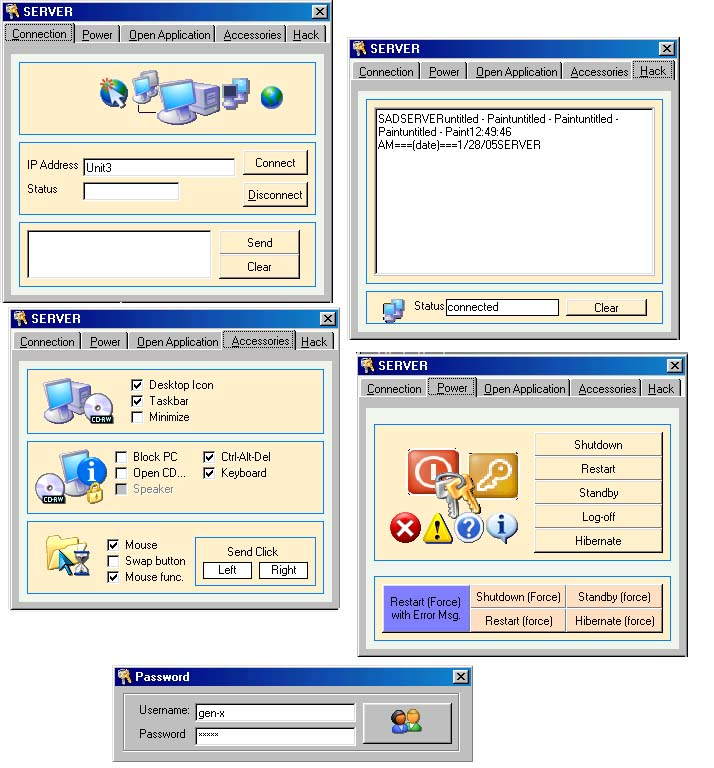



## GEN\-X NET CONTROL and KEYLOGGER

### Description

GEN-X NET CONTROL AND KEY LOGGER !!!MAY SYSTEM CONTROL KANA, MAY KEY LOGGER KA PA...UPDATE VERSION OF GEN-X NET COTROL..STILL PASSWORD.CONTROL THE APPLICATION, SYSTEM POWER, OPEN CALCULATOR,MOUSE, KEYBOARD,CD-ROM, DESKTOP ICONS,TASKBAR,AND KEY LOGGER
 
### More Info
 
ITS ONLY THE USERNAME AND PASSWORD....

PWEDE KA NANG MANG-NAKAW NG ACCOUNT NG IBA

KNOW ITS PASSWORD AND USERNAME !!!!

CONTROL THE CLIENT,,AND TRACE THE KEY LOGGED

ALL KEY LOGED CAN FIND IN C:\WINDOW\IO.TXT

             |
---                |---
**Submitted On**   |2005-01-28 01:10:40
**By**             |[Jenner Alagao](https://github.com/Planet-Source-Code/PSCIndex/blob/master/ByAuthor/jenner-alagao.md)
**Level**          |Advanced
**User Rating**    |5.0 (15 globes from 3 users)
**Compatibility**  |VB 6\.0
**Category**       |[Internet/ HTML](https://github.com/Planet-Source-Code/PSCIndex/blob/master/ByCategory/internet-html__1-34.md)
**World**          |[Visual Basic](https://github.com/Planet-Source-Code/PSCIndex/blob/master/ByWorld/visual-basic.md)
**Archive File**   |[GEN\-X\_NET\_1844941282005\.zip](https://github.com/Planet-Source-Code/jenner-alagao-gen-x-net-control-and-keylogger__1-58536/archive/master.zip)

